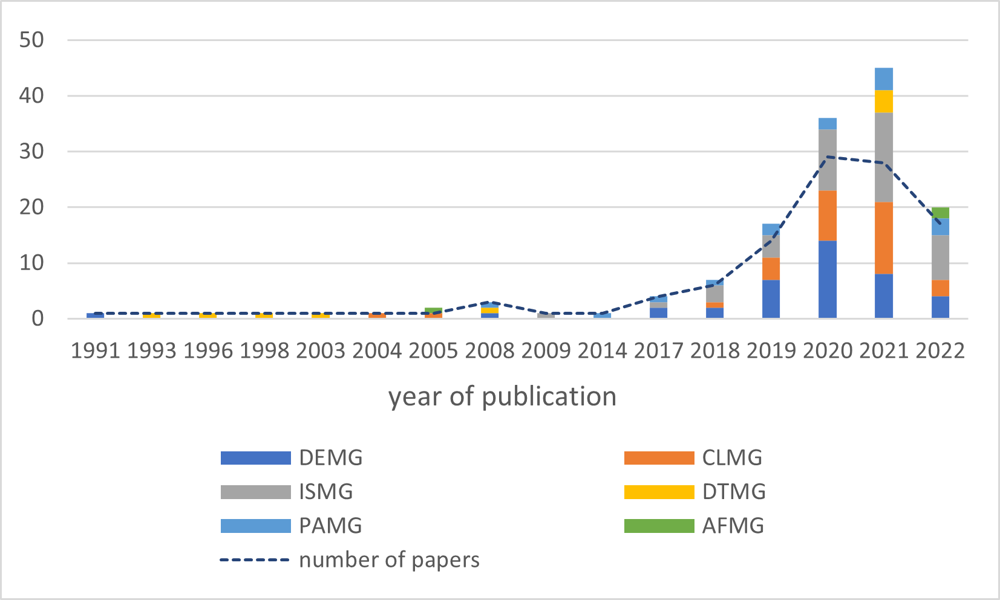
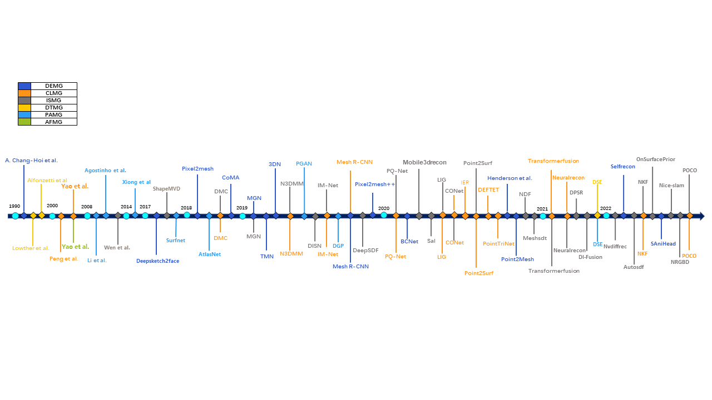

# 
 What’s the Situation with Intelligent Mesh Generation: A Survey and Perspectives

  
  <a href="url"  target="opentype">XXX</a> |<a href="url"  target="opentype">XXX</a>|<a href="url"  target="opentype">XXX</a>|<a href="url"  target="opentype">XXX</a> | <a href="url"  target="opentype">XXX</a>

  
  | <a href="url"  target="opentype">paper</a>|

This repository complements this article. To facilitate better access to the relevant literature, we provide links to the 110 articles mentioned in the article by technical categories, as well as the relevant codes for these articles. In addition, we also provide links to commonly used datasets.

## Outline
- [IMG_Survey](#What’s_the_Situation_with_Intelligent_Mesh_Generation:_A_Survey_and_Perspectives)
  - [Abstract](#Abstract)
  - [The main classification criteria](#The_main_classification_criteria)
  - [Timeline of main articles](#Timeline_of_main_articles)
  - [Annual distribution of articles of 6 technical types](#Annual_distribution_of_articles_of_6_technical_types)
  - [Links to articles and code](#links-to-articles-and-code)
    - [Deformation-based](#Deformation-based)
    - [Classification-based](#Classification-based)
    - [Isosurface-based](#Isosurface-based)
    - [Delaunay-triangulation-based](#Delaunay-triangulation-based)
    - [Parametrization-based](#Parametrization-based)
    - [Advancing-front-based](#Advancing-front-based)
  - [Common data set and links](#common-data-set-and-links)
    - [Triangle Mesh](#triangle-mesh)
    - [Quadrilateral mesh](#quadrilateral-mesh)
## Abstract
Intelligent mesh generation (IMG) is a relatively new field that refers to a kind of method to generate mesh by machine learning. IMG has greatly expanded the generalizability and practicality of mesh generation techniques, bringing many breakthroughs and potential possibilities for mesh generation. Within its short life span, we have seen tremendous advances in this field. However, there is a lack of surveys focusing on IMG methods covering recent works. In this article, we present an overview of the existing IMG methods systematically. Focusing on 110 preliminary studies describing different IMG methods, we conducted a comprehensive analysis and evaluation from the core technique and application scope of the algorithm, agent learning goals, data types, targeting challenges, advantages and limitations. With the aim of literature collection and classification based on content extraction, we provide three different taxonomies from three views of key technique, output mesh unit element, and applicable input data types. Finally, we highlight some promising future research directions and challenges in IMG.

## The main classification criteria

  

##  Annual distribution of articles of 6 technical types

## Timeline of main articles

## Links to articles and code

### Deformation-based
| Paper       | Code        | Source       |
| ----------- | ----------- | -----------|
| [A self-organizing neural network approach for automatic mesh generation](https://ieeexplore.ieee.org/abstract/document/105028)      | --       | IEEE Transactions on Magnetics 1991      |
|[DeepGarment : 3D Garment Shape Estimation from a Single Image](https://onlinelibrary.wiley.com/doi/abs/10.1111/cgf.13125)|--|Computer Graphics Forum 2017|
|[DeepSketch2Face: a deep learning based sketching system for 3D face and caricature modeling](https://dl.acm.org/doi/abs/10.1145/3072959.3073629)|[code](https://github.com/changgyhub/deepsketch2face)|TOG 2017|
|[Pixel2Mesh: Generating 3D Mesh Models from Single RGB Images](https://openaccess.thecvf.com/content_ECCV_2018/html/Nanyang_Wang_Pixel2Mesh_Generating_3D_ECCV_2018_paper.html)|[code](https://github.com/nywang16/Pixel2Mesh)|ECCV 2018|
|[Generating 3D Faces using Convolutional Mesh Autoencoders](https://openaccess.thecvf.com/content_ECCV_2018/html/Anurag_Ranjan_Generating_3D_Faces_ECCV_2018_paper.html)|[code](https://coma.is.tue.mpg.de/)|ECCV 2018|
|[Multi-Garment Net: Learning to Dress 3D People From Images](https://openaccess.thecvf.com/content_ICCV_2019/html/Bhatnagar_Multi-Garment_Net_Learning_to_Dress_3D_People_From_Images_ICCV_2019_paper.html)|[code](https://virtualhumans.mpi-inf.mpg.de/mgn/)|ICCV 2019|
|[3DN: 3D Deformation Network](https://openaccess.thecvf.com/content_CVPR_2019/html/Wang_3DN_3D_Deformation_Network_CVPR_2019_paper.html)|[code](https://github.com/star-cold/3d_project/tree/52d3ce5b703d433302c483b0b85ab8a07cc7cc6b/3DN)|CVPR 2019|
|[Deep Mesh Reconstruction From Single RGB Images via Topology Modification Networks](https://openaccess.thecvf.com/content_ICCV_2019/html/Pan_Deep_Mesh_Reconstruction_From_Single_RGB_Images_via_Topology_Modification_ICCV_2019_paper.html)|[code](https://github.com/jnypan/TMNet?utm_source=catalyzex.com)|ICCV 2019|
|[Neural 3D Morphable Models: Spiral Convolutional Networks for 3D Shape Representation Learning and Generation](https://openaccess.thecvf.com/content_ICCV_2019/html/Bouritsas_Neural_3D_Morphable_Models_Spiral_Convolutional_Networks_for_3D_Shape_ICCV_2019_paper.html)|[code]( https://github.com/gbouritsas/neural3DMM)|ICCV 2019|
|[HumanMeshNet: Polygonal Mesh Recovery of Humans](https://openaccess.thecvf.com/content_ICCVW_2019/html/3DRW/Venkat_HumanMeshNet_Polygonal_Mesh_Recovery_of_Humans_ICCVW_2019_paper.html)|[code](https://github.com/yudhik11/HumanMeshNet)|ICCVW 2019|
|[Mesh R-CNN](https://openaccess.thecvf.com/content_ICCV_2019/html/Gkioxari_Mesh_R-CNN_ICCV_2019_paper.html)|[code](https://github.com/facebookresearch/meshrcnn)|ICCV 2019|
|[Pixel2Mesh++: Multi-View 3D Mesh Generation via Deformation](https://openaccess.thecvf.com/content_ICCV_2019/html/Wen_Pixel2Mesh_Multi-View_3D_Mesh_Generation_via_Deformation_ICCV_2019_paper.html)|[code](https://github.com/walsvid/Pixel2MeshPlusPlus)|ICCV 2019|
|[BCNet: Learning Body and Cloth Shape from a Single Image](https://link.springer.com/chapter/10.1007/978-3-030-58565-5_2)|[code](https://github.com/jby1993/BCNet/tree/0bf7e0cb9a2f16989596ef8406582eb7d8fbfae8)|ECCV 2020|
|[Pixel2Mesh: 3D Mesh Model Generation via Image Guided Deformation](https://ieeexplore.ieee.org/abstract/document/9055070)|--|TAMPI 2020|
|[Voxel2Mesh: 3D Mesh Model Generation from Volumetric Data](https://link.springer.com/chapter/10.1007/978-3-030-59719-1_30)|[code](https://github.com/cvlab-epfl/voxel2mesh)|MICCAI 2020|
|[X-ray2Shape: Reconstruction of 3D Liver Shape from a Single 2D Projection Image](https://ieeexplore.ieee.org/abstract/document/9176655)|--|EMBC 2020|
|[3D Shape Reconstruction of Furniture Object from a Single Real Indoor Image](https://ieeexplore.ieee.org/abstract/document/9317479)|--|ICCWAMTIP 2020|
|[3D Reconstruction based on GAT from a Single Image](https://ieeexplore.ieee.org/abstract/document/9317527)|--|ICCWAMTIP 2020|
|[MeshingNet: A New Mesh Generation Method Based on Deep Learning](https://link.springer.com/chapter/10.1007/978-3-030-50420-5_14)|--|ICCS 2020|
|[Back To Meshes: Optimal Simulation-ready Mesh Prototypes For Autoencoder-based 3D Car Point Clouds](https://ieeexplore.ieee.org/abstract/document/9308400)|--|SSCI 2020|
|[Surface Hof: Surface Reconstruction From A Single Image Using Higher Order Function Networks](https://ieeexplore.ieee.org/abstract/document/9190842)|--|ICIP 2020|
|[Leveraging 2D Data to Learn Textured 3D Mesh Generation](https://openaccess.thecvf.com/content_CVPR_2020/html/Henderson_Leveraging_2D_Data_to_Learn_Textured_3D_Mesh_Generation_CVPR_2020_paper.html)|[code](https://github.com/pmh47/textured-mesh-gen)|CVPR 2020|
|[Mesh Variational Autoencoders With Edge Contraction Pooling](https://openaccess.thecvf.com/content_CVPRW_2020/html/w17/Yuan_Mesh_Variational_Autoencoders_With_Edge_Contraction_Pooling_CVPRW_2020_paper.html)|[code](https://github.com/IGLICT/MeshPooling)|CVPR 2020|
|[Point2Mesh: a self-prior for deformable meshes](https://dl.acm.org/doi/abs/10.1145/3386569.3392415)|[code](https://github.com/ranahanocka/Point2Mesh/)|TOG 2020|
|[Neural mesh flow: 3D manifold mesh generation via diffeomorphic flows](https://dl.acm.org/doi/abs/10.5555/3495724.3495872)|[code](https://github.com/KunalMGupta/NeuralMeshFlow)|NeurlPS 2020|
|[Learning Manifold Patch-Based Representations of Man-Made Shapes](https://openreview.net/forum?id=Gu5WqN9J3Fn)|[code](https://github.com/dmsm/LearningPatches)|ICLR 2020|
|[LASR: Learning Articulated Shape Reconstruction From a Monocular Video](https://openaccess.thecvf.com/content/CVPR2021/html/Yang_LASR_Learning_Articulated_Shape_Reconstruction_From_a_Monocular_Video_CVPR_2021_paper.html)|[code](https://github.com/google/lasr)|CVPR 2021|
|[Deep Active Surface Models](https://openaccess.thecvf.com/content/CVPR2021/html/Wickramasinghe_Deep_Active_Surface_Models_CVPR_2021_paper.html)|--|cvpr 2021|
|[Learning Local Recurrent Models for Human Mesh Recovery](https://ieeexplore.ieee.org/abstract/document/9665854)|--|2021 3DV|
|[Learning non-rigid surface reconstruction from spatia-temporal image patches](https://ieeexplore.ieee.org/abstract/document/9412352)|--|2021 ICPR|
|[Deep Hybrid Self-Prior for Full 3D Mesh Generation](https://openaccess.thecvf.com/content/ICCV2021/html/Wei_Deep_Hybrid_Self-Prior_for_Full_3D_Mesh_Generation_ICCV_2021_paper.html?ref=https://githubhelp.com)|--|ICCV 2021|
|[Mesh generation and optimization from digital rock fractures based on neural style transfer](https://www.sciencedirect.com/science/article/pii/S1674775521000500)|--|JRMGE 2021|
|[SkeletonNet: A Topology-Preserving Solution for Learning Mesh Reconstruction of Object Surfaces From RGB Images](https://ieeexplore.ieee.org/abstract/document/9448418)|[code](https://github.com/Gorilla-Lab-SCUT/SkeletonNet)|TAMPI 2021|
|[SelfRecon: Self Reconstruction Your Digital Avatar From Monocular Video](https://openaccess.thecvf.com/content/CVPR2022/html/Jiang_SelfRecon_Self_Reconstruction_Your_Digital_Avatar_From_Monocular_Video_CVPR_2022_paper.html)|[code](https://github.com/jby1993/SelfReconCode)|CVPR 2022 |
|[Mesh Convolutional Autoencoder for Semi-Regular Meshes of Different Sizes](https://openaccess.thecvf.com/content/WACV2022/html/Hahner_Mesh_Convolutional_Autoencoder_for_Semi-Regular_Meshes_of_Different_Sizes_WACV_2022_paper.html)|[code](https://github.com/Fraunhofer-SCAI/conv_sr_mesh_autoencoder)|WACV 2022|
|[TopoNet: Topology Learning for 3D Reconstruction of Objects of Arbitrary Genus](https://onlinelibrary.wiley.com/doi/abs/10.1111/cgf.14496)|--|Computer Graphics Forum 2022|
|[SAniHead: Sketching Animal-Like 3D Character Heads Using a View-Surface Collaborative Mesh Generative Network](https://ieeexplore.ieee.org/abstract/document/9222121)|--|TVCG 2022|

### Classification-based
| Paper       | Code        | Source       |
| ----------- | ----------- | -----------|
|[3D object reconstruction and representation using neural networks](https://dl.acm.org/doi/abs/10.1145/988834.988859)|--|Graphite 2004|
|[An ANN-based element extraction method for automatic mesh generation](https://www.sciencedirect.com/science/article/abs/pii/S0957417405000199)|--|Expert Systems with Applications 2005|
|[Deep Marching Cubes: Learning Explicit Surface Representations](https://openaccess.thecvf.com/content_cvpr_2018/html/Liao_Deep_Marching_Cubes_CVPR_2018_paper.html)|[code](https://github.com/yiyiliao/deep_marching_cubes)|CVPR 2018|
|[Occupancy Networks: Learning 3D Reconstruction in Function Space](https://openaccess.thecvf.com/content_CVPR_2019/html/Mescheder_Occupancy_Networks_Learning_3D_Reconstruction_in_Function_Space_CVPR_2019_paper.html)|[code](https://github.com/LMescheder/Occupancy-Networks)|CVPR 2019|
|[Learning Implicit Fields for Generative Shape Modeling](https://openaccess.thecvf.com/content_CVPR_2019/html/Chen_Learning_Implicit_Fields_for_Generative_Shape_Modeling_CVPR_2019_paper.html)|[code](https://github.com/czq142857/IM-NET)|CVPR 2019|
|[Scan2Mesh: From Unstructured Range Scans to 3D Meshes](https://openaccess.thecvf.com/content_CVPR_2019/html/Dai_Scan2Mesh_From_Unstructured_Range_Scans_to_3D_Meshes_CVPR_2019_paper.html)|[non-official](https://github.com/MohamedRamzy1/Scan2Mesh)|CVPR 2019|
|[Mesh R-CNN](https://openaccess.thecvf.com/content_ICCV_2019/html/Gkioxari_Mesh_R-CNN_ICCV_2019_paper.html)|[code](https://github.com/facebookresearch/meshrcnn)|ICCV 2019|
|[PQ-NET: A Generative Part Seq2Seq Network for 3D Shapes](https://openaccess.thecvf.com/content_CVPR_2020/html/Wu_PQ-NET_A_Generative_Part_Seq2Seq_Network_for_3D_Shapes_CVPR_2020_paper.html)|[code](https://github.com/ChrisWu1997/PQ-NET)|CVPR 2020|
|[Local Implicit Grid Representations for 3D Scenes](https://openaccess.thecvf.com/content_CVPR_2020/html/Jiang_Local_Implicit_Grid_Representations_for_3D_Scenes_CVPR_2020_paper.html)|[code](https://github.com/tensorflow/graphics/tree/master/tensorflow_graphics/projects/local_implicit_grid)|CVPR 2020|
|[Convolutional Occupancy Networks](https://link.springer.com/chapter/10.1007/978-3-030-58580-8_31)|[code](https://github.com/autonomousvision/convolutional_occupancy_networks)|ECCV 2020|
|[Interactive liquid splash modeling by user sketches](https://dl.acm.org/doi/abs/10.1145/3414685.3417832)|--|TOG 2020|
|[Meshing Point Clouds with Predicted Intrinsic-Extrinsic Ratio Guidance](https://link.springer.com/chapter/10.1007/978-3-030-58598-3_5)|[code](https://github.com/Colin97/Point2Mesh/tree/aa080b26692ad50ea9f35527764385545922aae1)|ECCV 2020|
|[POINTS2SURF Learning Implicit Surfaces from Point Clouds](https://link.springer.com/chapter/10.1007/978-3-030-58558-7_7)|[code](https://github.com/ErlerPhilipp/points2surf)|ECCV 2020|
|[Learning Deformable Tetrahedral Meshes for 3D Reconstruction](https://proceedings.neurips.cc/paper/2020/hash/7137debd45ae4d0ab9aa953017286b20-Abstract.html)|[code](https://github.com/nv-tlabs/DefTet)|NeurIPS 2020|
|[PointTriNet: Learned Triangulation of 3D Point Sets](https://link.springer.com/chapter/10.1007/978-3-030-58592-1_45)|[code](https://github.com/nmwsharp/learned-triangulation/blob/e3768ed79ab0272ccc141da967dbe296a7a6a2a8/README.md)|ECCV 2020|
|[REIN: Flexible Mesh Generation From Point Clouds](https://openaccess.thecvf.com/content_CVPRW_2020/html/w22/Daroya_REIN_Flexible_Mesh_Generation_From_Point_Clouds_CVPRW_2020_paper.html)|[code](https://github.com/rangeldaroya/rein/tree/7efd3995943b67de01662825b26699072ef29f0e)|CVPR 2020|
|[TransformerFusion: Monocular RGB Scene Reconstruction using Transformers](https://proceedings.neurips.cc/paper/2021/hash/0a87257e5308197df43230edf4ad1dae-Abstract.html)|[code](https://github.com/AljazBozic/TransformerFusion)|NeurlPS 2021|
|[Deep Implicit Surface Point Prediction Networks](https://openaccess.thecvf.com/content/ICCV2021/html/Venkatesh_Deep_Implicit_Surface_Point_Prediction_Networks_ICCV_2021_paper.html)|[code](https://sites.google.com/view/cspnet)|CVPR 2021|
|[NeuralRecon: Real-Time Coherent 3D Reconstruction From Monocular Video](https://openaccess.thecvf.com/content/CVPR2021/html/Sun_NeuralRecon_Real-Time_Coherent_3D_Reconstruction_From_Monocular_Video_CVPR_2021_paper.html?ref=https://githubhelp.com)|[code](https://github.com/zju3dv/NeuralRecon)|CVPR 2021|
|[SA-ConvONet: Sign-Agnostic Optimization of Convolutional Occupancy Networks](https://openaccess.thecvf.com/content/ICCV2021/html/Tang_SA-ConvONet_Sign-Agnostic_Optimization_of_Convolutional_Occupancy_Networks_ICCV_2021_paper.html?ref=https://githubhelp.com)|[code](https://github.com/tangjiapeng/SA-ConvONet)|ICCV 2021|
|[Vis2Mesh: Efficient Mesh Reconstruction From Unstructured Point Clouds of Large Scenes With Learned Virtual View Visibility](https://openaccess.thecvf.com/content/ICCV2021/html/Song_Vis2Mesh_Efficient_Mesh_Reconstruction_From_Unstructured_Point_Clouds_of_Large_ICCV_2021_paper.html)|[code](https://github.com/GDAOSU/vis2mesh)|ICCV 2021|
|[Deep Implicit Moving Least-Squares Functions for 3D Reconstruction](https://openaccess.thecvf.com/content/CVPR2021/html/Liu_Deep_Implicit_Moving_Least-Squares_Functions_for_3D_Reconstruction_CVPR_2021_paper.html?ref=https://githubhelp.com)|[code](https://github.com/Andy97/DeepMLS)|CVPR 2021|
|[DeepDT: Learning Geometry From Delaunay Triangulation for Surface Reconstruction](https://ojs.aaai.org/index.php/AAAI/article/view/16327)|[code](https://github.com/wenbingtao/DeepDT)|AAAI 2021|
|[NeeDrop: Self-supervised Shape Representation from Sparse Point Clouds using Needle Dropping](https://ieeexplore.ieee.org/abstract/document/9665876)|[code](https://github.com/valeoai/NeeDrop)|3DV 2021|
|[Learning and Meshing from Deep Implicit Surface Networks Using an Efficient Implementation of Analytic Marching](https://ieeexplore.ieee.org/abstract/document/9650726)|[code](https://github.com/Karbo123/AnalyticMesh)|TPAMI 2021|
|[Scalable Surface Reconstruction with Delaunay-Graph Neural Networks](https://onlinelibrary.wiley.com/doi/abs/10.1111/cgf.14364)|[code](https://github.com/raphaelsulzer/dgnn/tree/ac57525dd540bea84e00f1cc6c7666f10115adf6)|Computer Graph Forum 2021|
|[Neural marching cubes](https://dl.acm.org/doi/abs/10.1145/3478513.3480518)|[code](https://github.com/czq142857/NMC)|TOG 2021|
|[SkeletonNet: A Topology-Preserving Solution for Learning Mesh Reconstruction of Object Surfaces From RGB Images](https://ieeexplore.ieee.org/abstract/document/9448418)|[code](https://github.com/Gorilla-Lab-SCUT/SkeletonNet)|TAMPI 2021|
|[Neural Fields As Learnable Kernels for 3D Reconstruction](https://openaccess.thecvf.com/content/CVPR2022/html/Williams_Neural_Fields_As_Learnable_Kernels_for_3D_Reconstruction_CVPR_2022_paper.html)|[code](https://github.com/nv-tlabs/nkf)|CVPR 2022|
|[Neural Dual Contouring](https://arxiv.org/abs/2202.01999)|[code](https://github.com/czq142857/NDC)|TOG 2022|
|[POCO: Point Convolution for Surface Reconstruction](https://openaccess.thecvf.com/content/CVPR2022/html/Boulch_POCO_Point_Convolution_for_Surface_Reconstruction_CVPR_2022_paper.html)|[code](https://github.com/valeoai/POCO?utm_source=catalyzex.com)|CVPR 2022|

### Isosurface-based
| Paper       | Code        | Source      
| ----------- | ----------- | -----------|
|[LS-RBF network based 3D surface reconstruction method](https://ieeexplore.ieee.org/abstract/document/5195232)|--|CCDC 2009|
|[3D Shape Reconstruction from Sketches via Multi-view Convolutional Networks](https://ieeexplore.ieee.org/abstract/document/8374559)|[code](https://github.com/kitoriaaa/SketchModelingServer)|3DV 2017|
|[Robust flow-guided neural prediction for sketch-based freeform surface modeling](https://dl.acm.org/doi/abs/10.1145/3272127.3275051)|[code](https://github.com/Enigma-li/SketchCNN)|TOG 2018|
|[Deep Marching Cubes: Learning Explicit Surface Representations](https://openaccess.thecvf.com/content_cvpr_2018/html/Liao_Deep_Marching_Cubes_CVPR_2018_paper.html)|[code](https://github.com/yiyiliao/deep_marching_cubes)|CVPR 2018|
|[Learning to Reconstruct High-quality 3D Shapes with Cascaded Fully Convolutional Networks](https://openaccess.thecvf.com/content_ECCV_2018/html/Yan-Pei_Cao_Learning_to_Reconstruct_ECCV_2018_paper.html)|--|ECCV 2018|
|[Occupancy Networks: Learning 3D Reconstruction in Function Space](https://openaccess.thecvf.com/content_CVPR_2019/html/Mescheder_Occupancy_Networks_Learning_3D_Reconstruction_in_Function_Space_CVPR_2019_paper.html)|[code](https://github.com/LMescheder/Occupancy-Networks)|CVPR 2019|
|[DISN: Deep Implicit Surface Network for High-quality Single-view 3D Reconstruction](https://proceedings.neurips.cc/paper/2019/hash/39059724f73a9969845dfe4146c5660e-Abstract.html)|[code](https://github.com/laughtervv/DISN)|NIPS 2019|
|[Learning Implicit Fields for Generative Shape Modeling](https://openaccess.thecvf.com/content_CVPR_2019/html/Chen_Learning_Implicit_Fields_for_Generative_Shape_Modeling_CVPR_2019_paper.html)|[code](https://github.com/czq142857/IM-NET)|CVPR 2019|
|[DeepSDF: Learning Continuous Signed Distance Functions for Shape Representation](https://openaccess.thecvf.com/content_CVPR_2019/html/Park_DeepSDF_Learning_Continuous_Signed_Distance_Functions_for_Shape_Representation_CVPR_2019_paper.html)|[code](https://github.com/facebookresearch/DeepSDF)|CVPR 2019|
|[PQ-NET: A Generative Part Seq2Seq Network for 3D Shapes](https://openaccess.thecvf.com/content_CVPR_2020/html/Wu_PQ-NET_A_Generative_Part_Seq2Seq_Network_for_3D_Shapes_CVPR_2020_paper.html)|[code](https://github.com/ChrisWu1997/PQ-NET)|CVPR 2020|
|[Mobile3DRecon: Real-time Monocular 3D Reconstruction on a Mobile Phone](https://ieeexplore.ieee.org/abstract/document/9201064)|--|TVCG 2020|
|[SAL: Sign Agnostic Learning of Shapes From Raw Data](https://openaccess.thecvf.com/content_CVPR_2020/html/Atzmon_SAL_Sign_Agnostic_Learning_of_Shapes_From_Raw_Data_CVPR_2020_paper.html)|[code](https://github.com/matanatz/SAL)|CVPR 2020|
|[Meshlet Priors for 3D Mesh Reconstruction](https://openaccess.thecvf.com/content_CVPR_2020/html/Badki_Meshlet_Priors_for_3D_Mesh_Reconstruction_CVPR_2020_paper.html)|[code](https://github.com/NVlabs/meshlets/blob/5f918c18b4bc296dfa1f5428fa5fc66c3f4980a3/README.md)|CVPR 2020|
|[Local Implicit Grid Representations for 3D Scenes](https://openaccess.thecvf.com/content_CVPR_2020/html/Jiang_Local_Implicit_Grid_Representations_for_3D_Scenes_CVPR_2020_paper.html)|[code](https://github.com/tensorflow/graphics/tree/master/tensorflow_graphics/projects/local_implicit_grid)|CVPR 2020|
|[Convolutional Occupancy Networks](https://link.springer.com/chapter/10.1007/978-3-030-58580-8_31)|[code](https://github.com/autonomousvision/convolutional_occupancy_networks)|ECCV 2020|
|[Interactive liquid splash modeling by user sketches](https://dl.acm.org/doi/abs/10.1145/3414685.3417832)|--|TOG 2020|
|[POINTS2SURF Learning Implicit Surfaces from Point Clouds](https://link.springer.com/chapter/10.1007/978-3-030-58558-7_7)|[code](https://github.com/ErlerPhilipp/points2surf)|ECCV 2020|
|[SSRNet: Scalable 3D Surface Reconstruction Network](https://openaccess.thecvf.com/content_CVPR_2020/html/Mi_SSRNet_Scalable_3D_Surface_Reconstruction_Network_CVPR_2020_paper.html)|--|CVPR 2020|
|[Neural Unsigned Distance Fields for Implicit Function Learning](https://proceedings.neurips.cc/paper/2020/hash/f69e505b08403ad2298b9f262659929a-Abstract.html)|[code](https://github.com/jchibane/ndf/)|NeurIPS 2020|
|[MeshSDF: Differentiable Iso-Surface Extraction](https://proceedings.neurips.cc/paper/2020/hash/fe40fb944ee700392ed51bfe84dd4e3d-Abstract.html)|[code](https://github.com/cvlab-epfl/MeshSDF)|NeurIPS 2020|
|[TransformerFusion: Monocular RGB Scene Reconstruction using Transformers](https://proceedings.neurips.cc/paper/2021/hash/0a87257e5308197df43230edf4ad1dae-Abstract.html)|[code](https://github.com/AljazBozic/TransformerFusion)|NeurlPS 2021|
|[Deep Implicit Surface Point Prediction Networks](https://openaccess.thecvf.com/content/ICCV2021/html/Venkatesh_Deep_Implicit_Surface_Point_Prediction_Networks_ICCV_2021_paper.html)|[code](https://sites.google.com/view/cspnet)|CVPR 2021|
|[NeuralRecon: Real-Time Coherent 3D Reconstruction From Monocular Video](https://openaccess.thecvf.com/content/CVPR2021/html/Sun_NeuralRecon_Real-Time_Coherent_3D_Reconstruction_From_Monocular_Video_CVPR_2021_paper.html?ref=https://githubhelp.com)|[code](https://github.com/zju3dv/NeuralRecon)|CVPR 2021|
|[SA-ConvONet: Sign-Agnostic Optimization of Convolutional Occupancy Networks](https://openaccess.thecvf.com/content/ICCV2021/html/Tang_SA-ConvONet_Sign-Agnostic_Optimization_of_Convolutional_Occupancy_Networks_ICCV_2021_paper.html?ref=https://githubhelp.com)|[code](https://github.com/tangjiapeng/SA-ConvONet)|ICCV 2021|
|[Deep Marching Tetrahedra: a Hybrid Representation for High-Resolution 3D Shape Synthesis](https://proceedings.neurips.cc/paper/2021/hash/30a237d18c50f563cba4531f1db44acf-Abstract.html)|[code](https://nv-tlabs.github.io/DMTet/)|NerulPS 2021|
|[Deep Implicit Moving Least-Squares Functions for 3D Reconstruction](https://openaccess.thecvf.com/content/CVPR2021/html/Liu_Deep_Implicit_Moving_Least-Squares_Functions_for_3D_Reconstruction_CVPR_2021_paper.html?ref=https://githubhelp.com)|[code](https://github.com/Andy97/DeepMLS)|CVPR 2021|
|[RetrievalFuse: Neural 3D Scene Reconstruction With a Database](https://openaccess.thecvf.com/content/ICCV2021/html/Siddiqui_RetrievalFuse_Neural_3D_Scene_Reconstruction_With_a_Database_ICCV_2021_paper.html)|[code](https://github.com/nihalsid/retrieval-fuse)|ICCV 2021|
|[DeepDT: Learning Geometry From Delaunay Triangulation for Surface Reconstruction](https://ojs.aaai.org/index.php/AAAI/article/view/16327)|[code](https://github.com/wenbingtao/DeepDT)|AAAI 2021|
|[Iso-Points: Optimizing Neural Implicit Surfaces With Hybrid Representations](https://openaccess.thecvf.com/content/CVPR2021/html/Yifan_Iso-Points_Optimizing_Neural_Implicit_Surfaces_With_Hybrid_Representations_CVPR_2021_paper.html)|[code](https://github.com/yifita/iso-points)|CVPR 2021|
|[Shape As Points: A Differentiable Poisson Solver](https://proceedings.neurips.cc/paper/2021/hash/6cd9313ed34ef58bad3fdd504355e7Computer)|[code](https://github.com/autonomousvision/shape_as_points)|NerualPS 2021|
|[Deep Parametric Surfaces for 3D Outfit Reconstruction from Single View Image](https://ieeexplore.ieee.org/abstract/document/9667017)|--|FG 2021|
|[NeeDrop: Self-supervised Shape Representation from Sparse Point Clouds using Needle Dropping](https://ieeexplore.ieee.org/abstract/document/9665876)|[code](https://github.com/valeoai/NeeDrop)|3DV 2021|
|[Learning and Meshing from Deep Implicit Surface Networks Using an Efficient Implementation of Analytic Marching](https://ieeexplore.ieee.org/abstract/document/9650726)|[code](https://github.com/Karbo123/AnalyticMesh)|TPAMI 2021|
|[Neural-Pull: Learning Signed Distance Functions from Point Clouds by Learning to Pull Space onto Surfaces](https://proceedings.mlr.press/v139/ma21b.html)|[code](https://github.com/mabaorui/NeuralPull-Pytorch)|ICML 2021|
|[DI-Fusion: Online Implicit 3D Reconstruction With Deep Priors](https://openaccess.thecvf.com/content/CVPR2021/html/Huang_DI-Fusion_Online_Implicit_3D_Reconstruction_With_Deep_Priors_CVPR_2021_paper.html)|[code](https://github.com/huangjh-pub/di-fusion)|CVPR 2021|
|[Neural marching cubes](https://dl.acm.org/doi/abs/10.1145/3478513.3480518)|[code](https://github.com/czq142857/NMC)|TOG 2021|
|[SkeletonNet: A Topology-Preserving Solution for Learning Mesh Reconstruction of Object Surfaces From RGB Images](https://ieeexplore.ieee.org/abstract/document/9448418)|[code](https://github.com/Gorilla-Lab-SCUT/SkeletonNet)|TAMPI 2021|
|[Extracting Triangular 3D Models, Materials, and Lighting From Images](https://openaccess.thecvf.com/content/CVPR2022/html/Munkberg_Extracting_Triangular_3D_Models_Materials_and_Lighting_From_Images_CVPR_2022_paper.html)|[code](https://nvlabs.github.io/nvdiffrec/)|CVPR 2022|
|[AutoSDF: Shape Priors for 3D Completion, Reconstruction and Generation](https://openaccess.thecvf.com/content/CVPR2022/html/Mittal_AutoSDF_Shape_Priors_for_3D_Completion_Reconstruction_and_Generation_CVPR_2022_paper.html)|[code](https://github.com/yccyenchicheng/AutoSDF)|CVPR 2022|
|[Neural Fields As Learnable Kernels for 3D Reconstruction](https://openaccess.thecvf.com/content/CVPR2022/html/Williams_Neural_Fields_As_Learnable_Kernels_for_3D_Reconstruction_CVPR_2022_paper.html)|[code](https://github.com/nv-tlabs/nkf)|CVPR 2022|
|[Reconstructing Surfaces for Sparse Point Clouds With On-Surface Priors](https://openaccess.thecvf.com/content/CVPR2022/html/Ma_Reconstructing_Surfaces_for_Sparse_Point_Clouds_With_On-Surface_Priors_CVPR_2022_paper.html)|[code](https://github.com/mabaorui/OnSurfacePrior)|CVPR 2022|
|[Neural Dual Contouring](https://arxiv.org/abs/2202.01999)|[code](https://github.com/czq142857/NDC)|TOG 2022|
|[NICE-SLAM: Neural Implicit Scalable Encoding for SLAM](https://openaccess.thecvf.com/content/CVPR2022/html/Zhu_NICE-SLAM_Neural_Implicit_Scalable_Encoding_for_SLAM_CVPR_2022_paper.html)|[code](https://github.com/cvg/nice-slam)|CVPR 2022|
|[Neural RGB-D Surface Reconstruction](https://openaccess.thecvf.com/content/CVPR2022/html/Azinovic_Neural_RGB-D_Surface_Reconstruction_CVPR_2022_paper.html)|[code](https://github.com/dazinovic/neural-rgbd-surface-reconstruction)|CVPR 2022|

### Delaunay-triangulation-based
| Paper       | Code        | Source       |
| ----------- | ----------- | -----------|
| [A density driven mesh generator guided by a neural network](https://ieeexplore.ieee.org/abstract/document/250785)   | --       | IEEE T MAGN 1993    |
|[Automatic mesh generation by the let-it-grow neural network](https://ieeexplore.ieee.org/abstract/document/497496)|--| IEEE T MAGN 1996|
|[A finite element mesh generator based on an adaptive neural network](https://ieeexplore.ieee.org/abstract/document/717791)|--|IEEE T MAGN 1998|
|[A neural network generator for tetrahedral meshes](https://ieeexplore.ieee.org/abstract/document/1198547)|--|IEEE T MAGN 2003|
|[An Optimized Generator of Finite Element Meshes Based on a Neural Network](https://ieeexplore.ieee.org/abstract/document/4526786)|--|IEEE Transactions on Magnetics 2008|
|[Vis2Mesh: Efficient Mesh Reconstruction From Unstructured Point Clouds of Large Scenes With Learned Virtual View Visibility](https://openaccess.thecvf.com/content/ICCV2021/html/Song_Vis2Mesh_Efficient_Mesh_Reconstruction_From_Unstructured_Point_Clouds_of_Large_ICCV_2021_paper.html)|[code](https://github.com/GDAOSU/vis2mesh)|ICCV 2021|
|[Differentiable surface triangulation](https://dl.acm.org/doi/abs/10.1145/3478513.3480554)|[code](https://github.com/mrakotosaon/diff-surface-triangulation)|TOG 2021|
|[Learning Delaunay Surface Elements for Mesh Reconstruction](https://openaccess.thecvf.com/content/CVPR2021/html/Rakotosaona_Learning_Delaunay_Surface_Elements_for_Mesh_Reconstruction_CVPR_2021_paper.html?ref=https://githubhelp.com)|[code](https://github.com/mrakotosaon/dse-meshing)|CVPR 2021|
|[Scalable Surface Reconstruction with Delaunay-Graph Neural Networks](https://onlinelibrary.wiley.com/doi/abs/10.1111/cgf.14364)|[code](https://github.com/raphaelsulzer/dgnn/tree/ac57525dd540bea84e00f1cc6c7666f10115adf6)|Computer Graph Forum 2021|

### Parametrization-based
| Paper       | Code        | Source      
| ----------- | ----------- | -----------|
|[Incomplete Points Cloud Data Surface Reconstruction Based on Neural Network](https://ieeexplore.ieee.org/abstract/document/4604199)|--|IIHMSP 2008|
|[An Adaptive Learning Approach for 3-D Surface Reconstruction From Point Clouds](https://ieeexplore.ieee.org/abstract/document/4526697)|--|TNNLS 2008|
|[Robust surface reconstruction via dictionary learning](https://dl.acm.org/doi/abs/10.1145/2661229.2661263)|--|TOG 2014|
|[SurfNet: Generating 3D Shape Surfaces Using Deep Residual Networks](https://openaccess.thecvf.com/content_cvpr_2017/html/Sinha_SurfNet_Generating_3D_CVPR_2017_paper.html)|[code]( https://github.com/sinhayan/surfnet)|CVPR 2017|
|[A Papier-Mâché Approach to Learning 3D Surface Generation](https://openaccess.thecvf.com/content_cvpr_2018/html/Groueix_A_Papier-Mache_Approach_CVPR_2018_paper.html)|[code](https://github.com/ThibaultGROUEIX/AtlasNet)|CVPR 2018|
|[Multi-Garment Net: Learning to Dress 3D People From Images](https://openaccess.thecvf.com/content_ICCV_2019/html/Bhatnagar_Multi-Garment_Net_Learning_to_Dress_3D_People_From_Images_ICCV_2019_paper.html)|[code](https://virtualhumans.mpi-inf.mpg.de/mgn/)|ICCV 2019|
|[PGAN: Prediction Generative Adversarial Nets for Meshes](https://ieeexplore.ieee.org/abstract/document/8965985)|--|VCIP 2019|
|[Deep Geometric Prior for Surface Reconstruction](https://openaccess.thecvf.com/content_CVPR_2019/html/Williams_Deep_Geometric_Prior_for_Surface_Reconstruction_CVPR_2019_paper.html)|[code](https://github.com/fwilliams/deep-geometric-prior)|CVPR 2019|
|[Meshlet Priors for 3D Mesh Reconstruction](https://openaccess.thecvf.com/content_CVPR_2020/html/Badki_Meshlet_Priors_for_3D_Mesh_Reconstruction_CVPR_2020_paper.html)|[code](https://github.com/NVlabs/meshlets/blob/5f918c18b4bc296dfa1f5428fa5fc66c3f4980a3/README.md)|CVPR 2020|
|[Learning Manifold Patch-Based Representations of Man-Made Shapes](https://openreview.net/forum?id=Gu5WqN9J3Fn)|[code](https://github.com/dmsm/LearningPatches)|ICLR 2020|
|[Differentiable surface triangulation](https://dl.acm.org/doi/abs/10.1145/3478513.3480554)|[code](https://github.com/mrakotosaon/diff-surface-triangulation)|TOG 2021|
|[Deep Hybrid Self-Prior for Full 3D Mesh Generation](https://openaccess.thecvf.com/content/ICCV2021/html/Wei_Deep_Hybrid_Self-Prior_for_Full_3D_Mesh_Generation_ICCV_2021_paper.html?ref=https://githubhelp.com)|--|ICCV 2021|
|[Learning Delaunay Surface Elements for Mesh Reconstruction](https://openaccess.thecvf.com/content/CVPR2021/html/Rakotosaona_Learning_Delaunay_Surface_Elements_for_Mesh_Reconstruction_CVPR_2021_paper.html?ref=https://githubhelp.com)|[code](https://github.com/mrakotosaon/dse-meshing)|CVPR 2021|
|[Learning Direction Fields for Quad Mesh Generation](https://onlinelibrary.wiley.com/doi/abs/10.1111/cgf.14366)|--|Computer Graph Forum 2021|
|[Setch2PQ: Freeform Planar Quadrilateral Mesh Design via a Single Sketch](https://ieeexplore.ieee.org/abstract/document/9767703)|--|TVCG 2022|
|[MGNet: a novel differential mesh generation method based on unsupervised neural networks](https://link.springer.com/article/10.1007/s00366-022-01632-7)|--|Engineering with Computers 2022|
|[PCGAN: Prediction-Compensation Generative Adversarial Network for Meshes](https://ieeexplore.ieee.org/abstract/document/9650845)|--|TCSVT 2022|

### Advancing-front-based
| Paper       | Code        | Source       |
| ----------- | ----------- | -----------|
|[An ANN-based element extraction method for automatic mesh generation](https://www.sciencedirect.com/science/article/abs/pii/S0957417405000199)|--|Expert Systems with Applications 2005|
|[A new unstructured hybrid mesh generation method based on BP-ANN](https://iopscience.iop.org/article/10.1088/1742-6596/2280/1/012045/meta)|--|IPCS 2022|
|[Reinforcement learning for automatic quadrilateral mesh generation: a soft actor-critic approach](https://arxiv.org/abs/2203.11203)|--|arXiv:2203.11203|

## Common data set and links
### Triangle Mesh
Commonly used: [Princeton ModelNet](http://modelnet.cs.princeton.edu); [ShapeNet](https://shapenet.org/); [TOSCA](http://tosca.cs.technion.ac.il); [COSEG](http://web.siat.ac.cn/~yunhai/ssl/ssd.htm); surface reconstruction benchmark of [Berge](https://github.com/fwilliams/surface-reconstruction-benchmark) and [Williams](https://drive.google.com/file/d/17Elfc1TTRzIQJhaNu5m7SckBH_mdjYSe/view); [Thingi10K](https://ten-thousand-models.appspot.com/); [D-FAUST](https://dfaust.is.tue.mpg.de); [Famous](https://github.com/ErlerPhilipp/points2surf); [CAD dataset ABC](https://deep-geometry.github.io/abc-dataset); 

Dataset for single image 3D shape modeling: [Pix3d](https://github.com/xingyuansun/pix3d);

Facial expression dataset: [COMA](http://coma.is.tue.mpg.de/); [MeIn3D](https://github.com/menpo/lsfm);

Human body shapes datasets: [MGN](https://github.com/bharat-b7/MultiGarmentNetwork); [MultiHuman](http://liuyebin.com/dmc/dmc.html);

Clothed body meshes with real texture: [RenderPeople](https://renderpeople.com/free-3d-people); [Axyz](https://secure.axyz-design.com/); [Digit Wardrobe](https://github.com/bharat-b7/MultiGarmentNetwork); 

Indoor scenes datasets: [ScanNet](https://github.com/ScanNet/ScanNet); [Scenenet](); [Matterport3d](https://github.com/niessner/Matterport); [Synthetic Rooms](https://github.com/autonomousvision/convolutional_occupancy_networks);

### Quadrilateral mesh 
Commonly used :[QuadWild](https://www.quadmesh.cloud/);

Clothed body meshes with real texture: [RenderPeople](https://renderpeople.com/free-3d-people/);[Axyz](https://secure.axyz-design.com/);

## Citation 
If our survey helps in your research, please consider citing the following paper:
